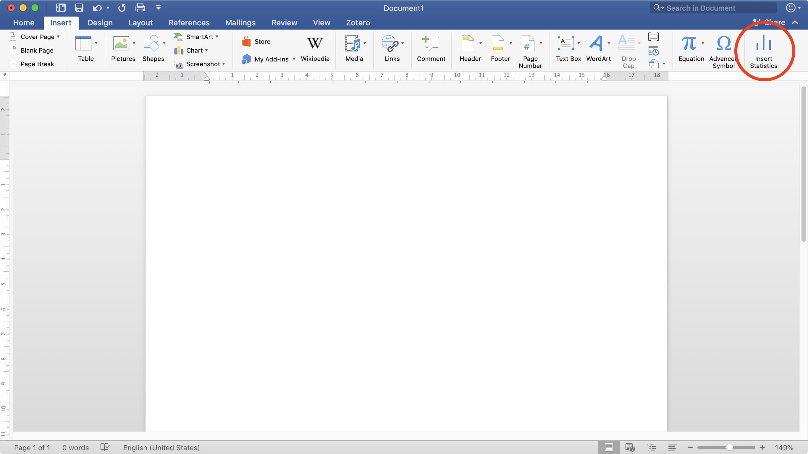
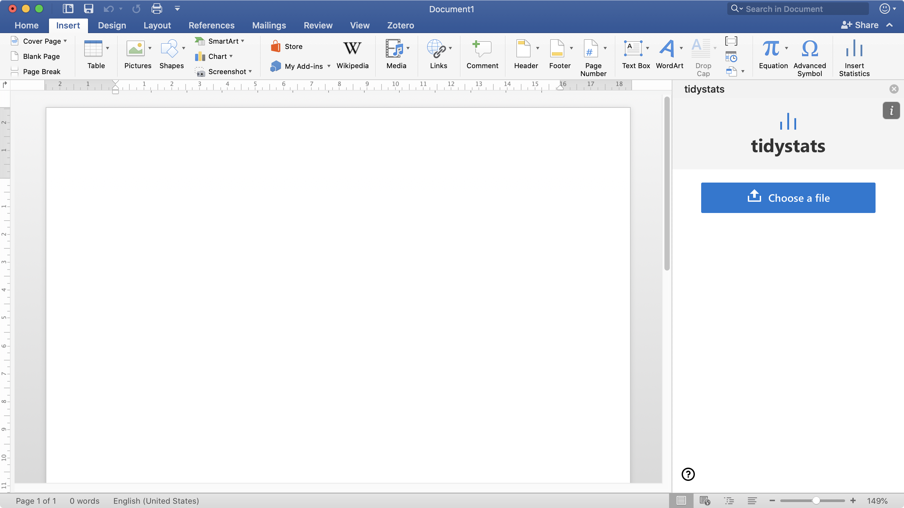
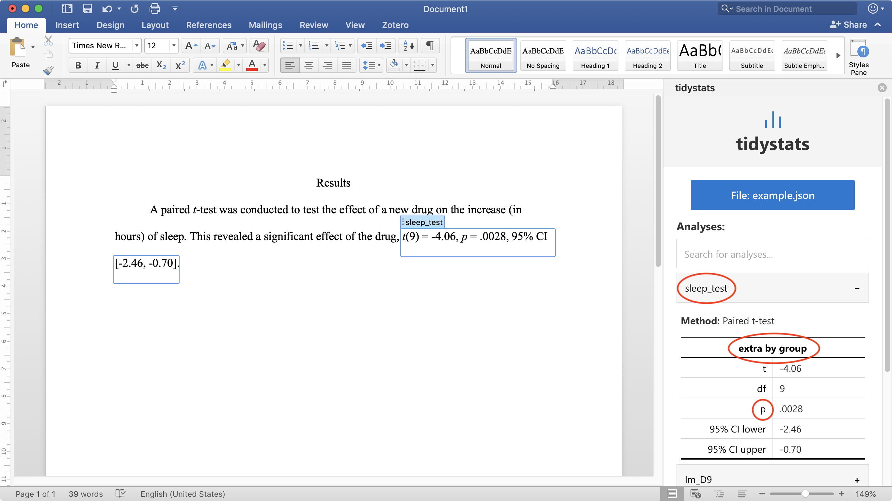

# tidystats Word add-in

The tidystats Word add-in is an add-in for Microsoft Word to insert statistics from a file created with the [tidystats](https://github.com/WillemSleegers/tidystats) R package. 

## Requirements

You need the following to use add-in:
- An internet connection (the add-in is a web app that runs inside of Word)
- A compatible version of Microsoft Word:
	- Word for iPad
	- Word 2016 for Mac
	- Word Online
	- Word 2013 or later
	- Word 2016 or later

For more information on the requirements, see [here](https://docs.microsoft.com/en-us/office/dev/add-ins/concepts/requirements-for-running-office-add-ins).

## Installation

**NOTE:** `tidystats` has been submitted to the Office Store but is not yet available. If you want to install it now, see the Testing section below.

## Usage

Before you can use the tidystats Word add-in, you must create a file containing your statistics using the `tidystats` R package. For details on how to do this, please see the [website](https://willemsleegers.github.io/tidystats/) of `tidystats`.

If you simply want to try out the add-in, you can also use [this](assets/tidystats/results.json) example file.

Once you have a file created with `tidystats` and you want to insert the statistics into your document, go to the Insert pane of your Word document and click on 'Insert Statistics'. 

Next, click on 'Choose a file' and select the file you created with `tidystats`. 

This should reveal a list of your analyses, each with a name that identifies your analyses. You can use the Search textbox to search for your analyses. Click on one of the analyses to reveal its statistics. You can then click on the name of a statistic or set of statistics to insert them into your document.

If you want to update the statistics, simply choose a new file and click on the 'Update statistics' button. Note that this does require that your analyses have the same identifier as in the previous file.

Finally, if you found the add-in useful, please cite the work. You can use the citation buttons to quickly insert a citation; thanks!

## Supported statistical tests

The following statistical tests, in R, are supported:

Package: **stats**
- `t.test()`
- `cor.test()`
- `chisq.test()`
- `wilcox.test()`
- `fisher.test()`
- `oneway.test()`
- `aov()`
- `lm()`

## More resources

Please see the following links for more information on how to use `tidystats` R package.

- [tidystats website](https://willemsleegers.github.io/tidystats/)
- [www.willemsleegers.com/tidystats](https://www.willemsleegers.com/tidystats.html)

If you have any questions about how to use `tidystats`, or suggestions for improvements, you can contact me on [Twitter](https://twitter.com/willemsleegers) or via [e-mail](mailto:tidystats@gmail.com).

## Testing

The current release version of the add-in is 1.0. This means that the add-in is sort of feature complete, but there is still a lot of room for improvements and new features. If you want to help test these newer versions, you can install the development version of the add-in. For instructions on how to do this, see below.

### Installing the development version of tidystats for Word

Download the manifest.xml file from the Github [page](https://github.com/WillemSleegers/tidystats-Word-add-in). This is the file that needs to be installed on your computer somewhere in order to run the add-in.

#### Mac

To install the add-in in Mac, see the 'Sideload an add-in in Office on Mac' section [here](https://docs.microsoft.com/en-us/office/dev/add-ins/testing/sideload-an-office-add-in-on-ipad-and-mac#sideload-an-add-in-in-office-on-mac). Briefly put, you need to put the manifest file in the following folder:

> /Users/\<username\>/Library/Containers/com.microsoft.Word/Data/Documents/wef

If the 'wef' folder does not exist yet, simply create it and put the manifest file inside. After doing that, you can access the add-in via Insert ribbon > Add-ins > My Add-ins (click on the dropdown arrow; only then will you see the Developer add-ins). You should see the tidystats add-in in the list. Simply click on it and the add-in will open.

That's it for Mac <3. 

#### Windows

To install the add-in in Windows, see [this](https://docs.microsoft.com/en-us/office/dev/add-ins/testing/create-a-network-shared-folder-catalog-for-task-pane-and-content-add-ins) webpage. When you copy the path to the shared folder, make sure it is a valid path (When I copied the path in step 5 of 'Share a folder' it also added some extra text to the front and end of the path).

### Bugs and feature requests

Found a bug or got an idea about how to improve the add-in? Please create a [Github issue](https://github.com/WillemSleegers/tidystats-Word-add-in/issues). If you need some help figuring out how this works, see this support [page](https://help.github.com/en/articles/creating-an-issue) by Github or simply contact me on [Twitter](https://twitter.com/willemsleegers) or send me an [e-mail](mailto:tidystats@gmail.com).