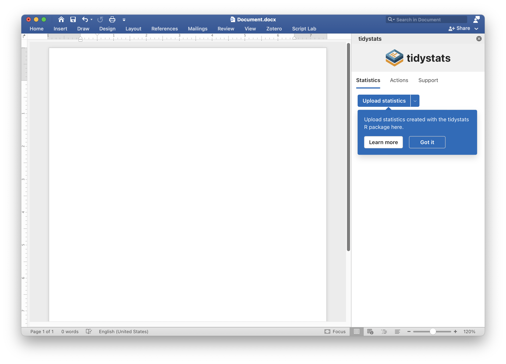

# tidystats Word add-in

The tidystats Word add-in is an add-in for Microsoft Word to insert statistics from a file created with the [tidystats](https://github.com/WillemSleegers/tidystats) R package.

## Requirements

You need the following to use add-in:

- An internet connection (the add-in is a web app that runs inside of Word)
- A compatible version of Microsoft Word:
  - Word 2016 or later on Windows
  - Word 2016 or later on Mac
  - Word on the web

For more information on the requirements, see [here](https://docs.microsoft.com/en-us/office/dev/add-ins/concepts/requirements-for-running-office-add-ins).

## Installation

The add-in will is available in the Office add-in store. The add-in can be installed via the add-in store, which can be found in the Insert tab of your Word document.

## Usage

Before you can use the tidystats Word add-in, you must create a file containing your statistics using the `tidystats` R package. For details on how to do this, please see the [introduction to tidystats](https://willemsleegers.github.io/tidystats/articles/introduction-to-tidystats.html) vignette on the R package [website](https://willemsleegers.github.io/tidystats/) of `tidystats`.

If you simply want to try out the add-in, you can also use [this](src/assets/results.json) example file.

Once you have a file created with `tidystats` and you want to insert the statistics into your document, go to the Insert pane of your Word document and click on 'Insert Statistics'.

Next, click on 'Upload statistics' and select the file you created with `tidystats`.

This should reveal a list of your analyses, each with a name that identifies your analysis. You can use the Search text box to search for your analyses. Click on one of the analyses to reveal its statistics. You can then click on the name of a statistic or set of statistics to insert them into your document.

By default, clicking on 'Statistics:' will insert all the statistics. If you only want to insert a subset of the analyses, click on the gear icon next to 'Statistics:' and select the statistics you would like to insert.

If you want to update the statistics, simply choose a new file and click on the 'Update statistics' button. Note that this does require that your analyses have the same identifier as in the previous file.

Finally, if you found the add-in useful, please cite the software. You can use the citation buttons to quickly insert a citation; thanks!

## Supported statistical tests

tidystats has built-in support for statistical tests from R packages such as stats, lme4, BayesFactor, brms, afex, and many others. For a complete overview of supported functions, see the [Supported functions](https://willemsleegers.github.io/tidystats/articles/supported-functions.html) vignette.

It is also possible to use tidystats to report statistics from unsupported functions using the `custom_stat()` and `custom_stats()` functions from the R package. For a tutorial on how to use these functions, see the [Custom statistics](https://willemsleegers.github.io/tidystats/articles/custom-statistics.html#example-2-using-custom_stats) vignette.

## More resources

For more information on tidystats, see its website at [https://tidystats.io](https://tidystats.io).

If you have any questions about how to use `tidystats`, or suggestions for improvements, you can contact me on [X](https://twitter.com/tidystats) or via [e-mail](mailto:tidystats@gmail.com).

## Testing

The current release version of the add-in is 1.1. This means that the add-in is sort of feature complete, but there is still a lot of room for improvements and new features. If you want to help test newer versions, you can install the development version of the add-in. For instructions on how to do this, see below.

### Installing the development version of tidystats for Word

Download one of the manifest files. This is the file that needs to be installed on your computer somewhere in order to run the add-in. Download the local manifest file if you can host the web-app yourself; download the netlify manifest file for the most recent version of tidystats; and download the web manifest file for the latest official release version of tidystats.

#### Mac

To install the add-in in Mac, see the 'Sideload an add-in in Office on Mac' section [here](https://docs.microsoft.com/en-us/office/dev/add-ins/testing/sideload-an-office-add-in-on-ipad-and-mac#sideload-an-add-in-in-office-on-mac). Briefly put, you need to put the manifest file in the following folder:

> /Users/\<username\>/Library/Containers/com.microsoft.Word/Data/Documents/wef

If the 'wef' folder does not exist yet, simply create it and put the manifest file inside. After doing that, you can access the add-in via Insert ribbon > Add-ins > My Add-ins (click on the dropdown arrow; only then will you see the Developer add-ins). You should see the tidystats add-in in the list. Simply click on it and the add-in will open.

That's it for Mac <3.

#### Windows

Start by creating a new folder somewhere on your computer. Share this folder by right-clicking on the folder and select Properties. Go to the Sharing tab and click on the Share button to start sharing the folder. This step should create a network path. Copy this path.

Open a Word document and go to File -> Options -> Trust Center. Here, click on Trust Center Settings and then Trusted Add-in Catalogs. In the Catalog Url box, enter the full network path to the folder that you shared previously. Click on Add catalog and make sure the Show in Menu checkbox is checked. Click on OK and restart Word.

Next, put the manifest file you downloaded from here in the shared folder.

In Word, go to the Insert tab and click on My Add-ins. Choose Shared Folder at the top of the Office Add-ins dialog box. Select the name of the add-in and choose Add to insert the add-in. The add-in should now be installed.

For more information, see [this](https://docs.microsoft.com/en-us/office/dev/add-ins/testing/create-a-network-shared-folder-catalog-for-task-pane-and-content-add-ins) webpage, which also includes a link to a Youtube video explaining how to install the add-in.

### Bugs and feature requests

Found a bug or got an idea about how to improve the add-in? Please create a [Github issue](https://github.com/WillemSleegers/tidystats-Word-add-in/issues). If you need some help figuring out how this works, see this support [page](https://help.github.com/en/articles/creating-an-issue) by Github or simply contact me on [X](https://twitter.com/tidystats) or send me an [e-mail](mailto:tidystats@gmail.com).

